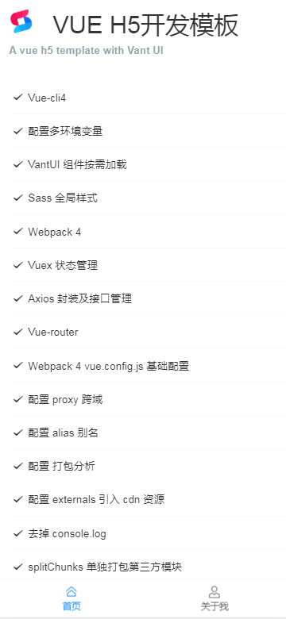
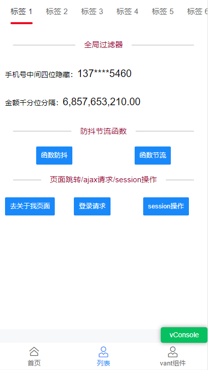
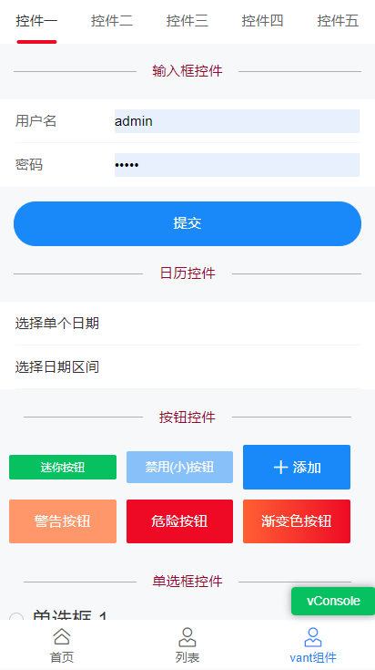
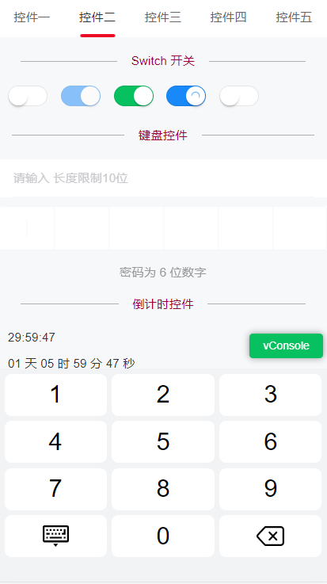
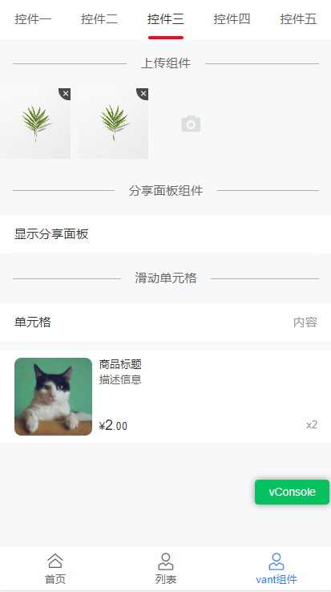
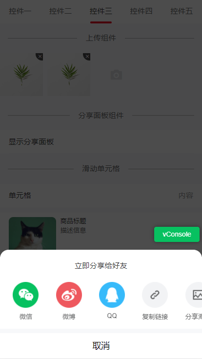
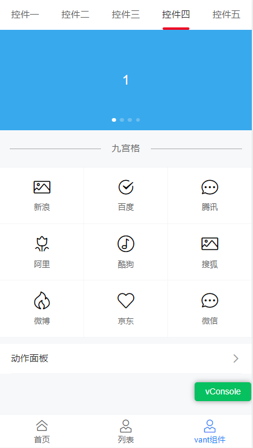
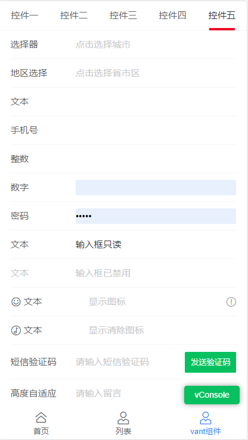

# vue-h5-template

基于 vue-cli4.0 + webpack 4 + vant ui + sass+ rem 适配方案+axios 封装，构建手机端模板脚手架

掘金: [vue-cli4 vant rem 移动端框架方案](https://juejin.im/post/5cfefc73f265da1bba58f9f7)

### 页面效果
<p>
  
  <p style="margin-top:10px;color:#990030;"><font color=#990030>1.防抖节流函数</font></p>
  
  <p style="margin-top:10px;color:#990030;">2.文本框、日历、按钮控件</p>
  
  <p style="margin-top:10px;color:#990030;">3.软键盘输入</p>
  
  <p style="margin-top:10px;color:#990030;">4.上传组件</p>
  
  <p style="margin-top:10px;color:#990030;">5.分享面板</p>
  
  <p style="margin-top:10px;color:#990030;">6.轮播图和九宫格</p>
  
  <p style="margin-top:10px;color:#990030;">7.常用form表单</p>
  
</p>

### Node 版本要求

`Vue CLI` 需要 Node.js 8.9 或更高版本 (推荐 8.11.0+)。你可以使用 [nvm](https://github.com/nvm-sh/nvm) 或
[nvm-windows](https://github.com/coreybutler/nvm-windows) 在同一台电脑中管理多个 Node 版本。

本示例 Node.js 12.14.1

### 启动项目

```bash

git clone https://gitee.com/wangxinyanqc/vue-h5-page.git

cd vue-h5-template

npm install

npm run serve
```

### less-loader 版本要求
npm install less-loader@5.0.0  (安装指定版本)

<span id="top">目录</span>

- √ Vue-cli4
- [√ 配置多环境变量](#env)
- [√ rem 适配方案](#rem)
- [√ vm 适配方案](#vm)
- [√ VantUI 组件按需加载](#vant)
- [√ Sass 全局样式](#sass)
- [√ Vuex 状态管理](#vuex)
- [√ Vue-router](#router)
- [√ Axios 封装及接口管理](#axios)
- [√ Webpack 4 vue.config.js 基础配置](#base)
- [√ 配置 alias 别名](#alias)
- [√ 配置 proxy 跨域](#proxy)
- [√ 配置 打包分析](#bundle)
- [√ 配置 externals 引入 cdn 资源 ](#externals)
- [√ 去掉 console.log ](#console)
- [√ splitChunks 单独打包第三方模块](#chunks)
- [√ 添加 IE 兼容 ](#ie)
- [√ Eslint+Pettier 统一开发规范 ](#pettier)

### <span id="env">✅ 配置多环境变量 </span>

`package.json` 里的 `scripts` 配置 `serve` `stage` `build`，通过 `--mode xxx` 来执行不同环境

- 通过 `npm run serve` 启动本地 , 执行 `development`
- 通过 `npm run stage` 打包测试 , 执行 `staging`
- 通过 `npm run build` 打包正式 , 执行 `production`

```javascript
"scripts": {
  "serve": "vue-cli-service serve --open",
  "stage": "vue-cli-service build --mode staging",
  "build": "vue-cli-service build",
}
```

##### 配置介绍

&emsp;&emsp;以 `VUE_APP_` 开头的变量，在代码中可以通过 `process.env.VUE_APP_` 访问。  
&emsp;&emsp;比如,`VUE_APP_ENV = 'development'` 通过`process.env.VUE_APP_ENV` 访问。  
&emsp;&emsp;除了 `VUE_APP_*` 变量之外，在你的应用代码中始终可用的还有两个特殊的变量`NODE_ENV` 和`BASE_URL`

在项目根目录中新建`.env.*`

- .env.development 本地开发环境配置

```bash
NODE_ENV='development'
# must start with VUE_APP_
VUE_APP_ENV = 'development'

```

- .env.staging 测试环境配置

```bash
NODE_ENV='production'
# must start with VUE_APP_
VUE_APP_ENV = 'staging'
```

- .env.production 正式环境配置

```bash
 NODE_ENV='production'
# must start with VUE_APP_
VUE_APP_ENV = 'production'
```

这里我们并没有定义很多变量，只定义了基础的 VUE_APP_ENV `development` `staging` `production`  
变量我们统一在 `src/config/env.*.js` 里进行管理。

这里有个问题，既然这里有了根据不同环境设置变量的文件，为什么还要去 config 下新建三个对应的文件呢？  
**修改起来方便，不需要重启项目，符合开发习惯。**

config/index.js

```javascript
// 根据环境引入不同配置 process.env.NODE_ENV
const config = require('./env.' + process.env.VUE_APP_ENV)
module.exports = config
```

配置对应环境的变量，拿本地环境文件 `env.development.js` 举例，用户可以根据需求修改

```javascript
// 本地环境配置
module.exports = {
  title: 'vue-h5-template',
  baseUrl: 'http://localhost:8080', // 项目地址
  baseApi: 'https://test.xxx.com/api', // 本地api请求地址
  APPID: 'xxx',
  APPSECRET: 'xxx'
}
```

根据环境不同，变量就会不同了

```javascript
// 根据环境不同引入不同baseApi地址
import { baseApi } from '@/config'
console.log(baseApi)
```

[▲ 回顶部](#top)

### <span id="rem">✅ rem 适配方案 </span>

不用担心，项目已经配置好了 `rem` 适配, 下面仅做介绍：

Vant 中的样式默认使用`px`作为单位，如果需要使用`rem`单位，推荐使用以下两个工具:

- [postcss-pxtorem](https://github.com/cuth/postcss-pxtorem) 是一款 `postcss` 插件，用于将单位转化为 `rem`
- [lib-flexible](https://github.com/amfe/lib-flexible) 用于设置 `rem` 基准值

##### PostCSS 配置

下面提供了一份基本的 `postcss` 配置，可以在此配置的基础上根据项目需求进行修改

```javascript
// https://github.com/michael-ciniawsky/postcss-load-config
module.exports = {
  plugins: {
    autoprefixer: {
      overrideBrowserslist: ['Android 4.1', 'iOS 7.1', 'Chrome > 31', 'ff > 31', 'ie >= 8']
    },
    'postcss-pxtorem': {
      rootValue: 37.5,
      propList: ['*']
    }
  }
}
```

更多详细信息： [vant](https://youzan.github.io/vant/#/zh-CN/quickstart#jin-jie-yong-fa)

很多小伙伴会问我，适配的问题,因为我们使用的是 Vant UI，所以必须根据 Vant UI 375 的设计规范走，一般我们的设计会将 UI 图上
传到蓝湖，我们就可以需要的尺寸了。下面就大搞普及一下 rem。

我们知道 `1rem` 等于`html` 根元素设定的 `font-size` 的 `px` 值。Vant UI 设置 `rootValue: 37.5`,你可以看到在 iPhone 6 下
看到 （`1rem 等于 37.5px`）：

```html
<html data-dpr="1" style="font-size: 37.5px;"></html>
```

切换不同的机型，根元素可能会有不同的`font-size`。当你写 css px 样式时，会被程序换算成 `rem` 达到适配。

因为我们用了 Vant 的组件，需要按照 `rootValue: 37.5` 来写样式。

举个例子：设计给了你一张 750px \* 1334px 图片，在 iPhone6 上铺满屏幕,其他机型适配。

- 当`rootValue: 75` , 样式 `width: 750px;height: 1334px;` 图片会撑满 iPhone6 屏幕，这个时候切换其他机型，图片也会跟着撑
  满。
- 当`rootValue: 37.5` 的时候，样式 `width: 375px;height: 667px;` 图片会撑满 iPhone6 屏幕。

也就是 iphone 6 下 375px 宽度写 CSS。其他的你就可以根据你设计图，去写对应的样式就可以了。

当然，想要撑满屏幕你可以使用 100%，这里只是举例说明。

```html


<style>
  /* rootValue: 75 */
  .image {
    width: 750px;
    height: 1334px;
  }
  /* rootValue: 37.5 */
  .image {
    width: 375px;
    height: 667px;
  }
</style>
```

### <span id="vw">✅ vm 适配方案 </span>

本项目使用的是 rem 的 适配方案，其实无论你使用哪种方案，都不需要你去计算 12px 是多少 rem 或者 vw, 会有专门的工具去帮你做
。如果你想用 vw，你可以按照下面的方式切换。

#### 1.安装依赖

```bash

npm install postcss-px-to-viewport -D

```

#### 2.修改 .postcssrc.js

将根目录下 .postcssrc.js 文件修改如下

```javascript
// https://github.com/michael-ciniawsky/postcss-load-config
module.exports = {
  plugins: {
    autoprefixer: {
      overrideBrowserslist: ['Android 4.1', 'iOS 7.1', 'Chrome > 31', 'ff > 31', 'ie >= 8']
    },
    'postcss-px-to-viewport': {
      viewportWidth: 375, // 视窗的宽度，对应的是我们设计稿的宽度，一般是750
      unitPrecision: 3, // 指定`px`转换为视窗单位值的小数位数（很多时候无法整除）
      viewportUnit: 'vw', // 指定需要转换成的视窗单位，建议使用vw
      selectorBlackList: ['.ignore', '.hairlines'], // 指定不转换为视窗单位的类，可以自定义，可以无限添加,建议定义一至两个通用的类名
      minPixelValue: 1, // 小于或等于`1px`不转换为视窗单位，你也可以设置为你想要的值
      mediaQuery: false // 允许在媒体查询中转换`px`
    }
  }
}
```

#### 3.删除原来的 rem 相关代码

src/main.js 删除如下代码

```javascript
// 移动端适配
import 'lib-flexible/flexible.js'
```

package.json 删除如下代码

```javascript
"lib-flexible": "^0.3.2",
"postcss-pxtorem": "^5.1.1",
```

运行起来，F12 元素 css 就是 vw 单位了

[▲ 回顶部](#top)

### <span id="vant">✅ VantUI 组件按需加载 </span>

项目采
用[Vant 自动按需引入组件 (推荐)](https://youzan.github.io/vant/#/zh-CN/quickstart#fang-shi-yi.-zi-dong-an-xu-yin-ru-zu-jian-tui-jian)下
面安装插件介绍：

[babel-plugin-import](https://github.com/ant-design/babel-plugin-import) 是一款 `babel` 插件，它会在编译过程中将
`import` 的写法自动转换为按需引入的方式

#### 安装插件

```bash
npm i babel-plugin-import -D
```

在`babel.config.js` 设置

```javascript
// 对于使用 babel7 的用户，可以在 babel.config.js 中配置
const plugins = [
  [
    'import',
    {
      libraryName: 'vant',
      libraryDirectory: 'es',
      style: true
    },
    'vant'
  ]
]
module.exports = {
  presets: [['@vue/cli-plugin-babel/preset', { useBuiltIns: 'usage', corejs: 3 }]],
  plugins
}
```

#### 使用组件

项目在 `src/plugins/vant.js` 下统一管理组件，用哪个引入哪个，无需在页面里重复引用

```javascript
// 按需全局引入 vant组件
import Vue from 'vue'
import { Button, List, Cell, Tabbar, TabbarItem } from 'vant'
Vue.use(Button)
Vue.use(Cell)
Vue.use(List)
Vue.use(Tabbar).use(TabbarItem)
```
### 个人网站
http://www.wxyweb.com

### 个人博客
https://wangxinyan.blog.csdn.net
